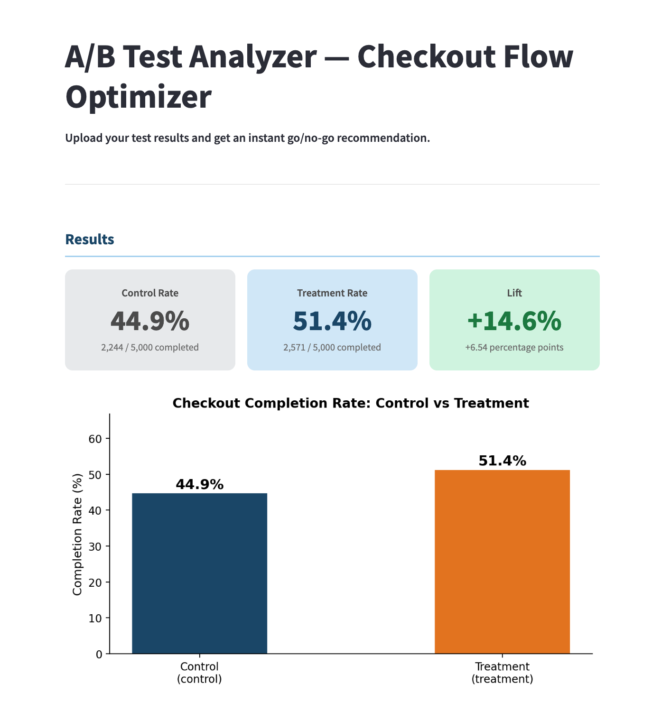
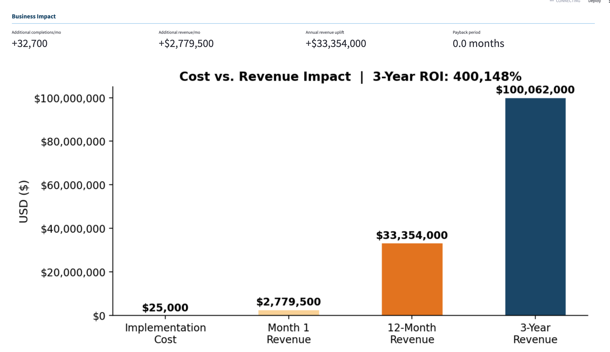
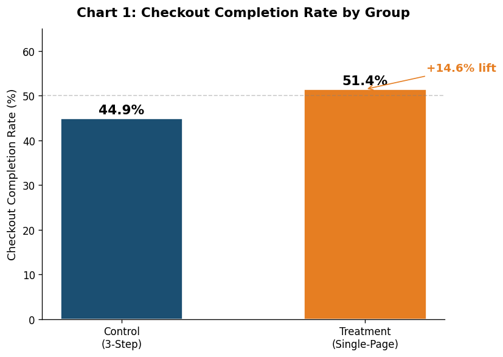
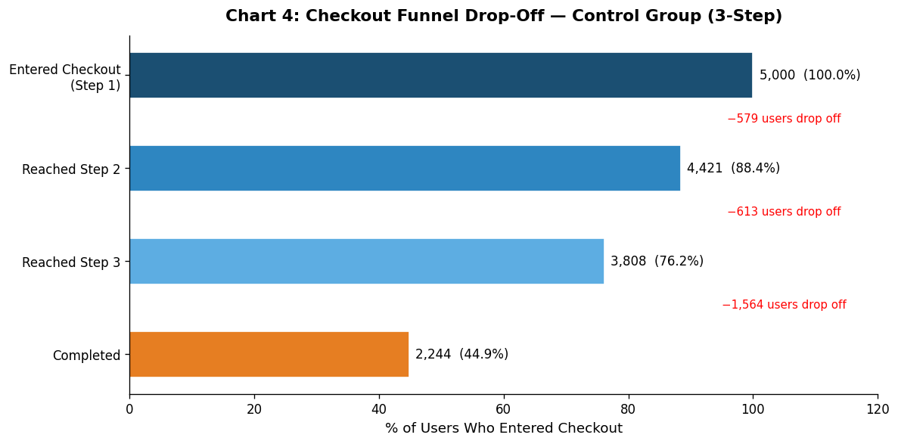
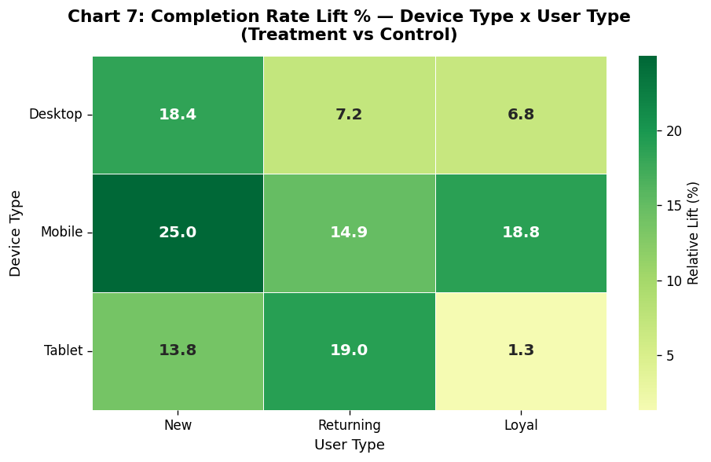

# A/B Test Analysis — Checkout Flow Optimization

**Portfolio Project 4 | Business Analytics**

An end-to-end A/B test analysis determining whether a single-page checkout reduces cart abandonment compared to a 3-step checkout. Delivered as both a Jupyter notebook and an interactive Streamlit app.

---

## Business Problem

An e-commerce company suspects their 3-step checkout is causing cart abandonment. They ran an A/B test:

- **Control (Group A):** Existing 3-step checkout
- **Treatment (Group B):** New single-page checkout

**Key question:** Is the difference in checkout completion rates statistically significant, and what is the projected revenue impact?

---

## Project Structure

```
AB-Test-Checkout-Flow/
├── data/
│   └── raw/
│       └── checkout_ab_test.csv     # Synthetic dataset (10,000 users)
├── notebooks/
│   └── ab_test_analysis.ipynb       # Full analysis notebook
├── app/
│   └── ab_test_app.py               # Interactive Streamlit app
├── charts/                          # All saved chart PNGs
├── outputs/                         # Exported results
├── .gitattributes
├── .gitignore
├── requirements.txt
└── README.md
```

---

## Setup

### 1. Install dependencies

```bash
pip install -r requirements.txt
```

### 2. Run the Jupyter Notebook

```bash
jupyter notebook notebooks/ab_test_analysis.ipynb
```

### 3. Run the Streamlit App

```bash
streamlit run app/ab_test_app.py
```

The app works out of the box with the generated dataset at `data/raw/checkout_ab_test.csv`. You can also upload your own CSV.

---

## Analysis Overview

### Notebook Sections
0. **Business Context** — What was tested and why it matters
1. **Data Loading & Validation** — Sample sizes, balance checks, baseline metrics
2. **Exploratory Analysis** — 6 charts covering completion rates, funnel drop-off, time-to-complete, and cart value distribution
3. **Statistical Testing** — Chi-square, Z-test, p-value, 95% CI, statistical power, Mann-Whitney U
4. **Business Impact** — Revenue uplift, payback period, 3-year ROI
5. **Subgroup Analysis** — Lift by device type and user type, heatmap
6. **Recommendation** — Plain-English go/no-go verdict with next steps

### Streamlit App Features
- Upload any A/B test CSV
- Configure group/outcome columns and significance level
- Instant metric cards, statistical results, and traffic-light verdict
- Business impact calculator with ROI chart

---

## Key Assumptions (Business Impact)

| Parameter | Value |
|---|---|
| Monthly visitors | 500,000 |
| Average order value | $85 |
| Current completion rate | 45% |
| Treatment completion rate | 52% |
| Implementation cost | $25,000 |

---

## Dataset Specs

| Column | Description |
|---|---|
| `user_id` | Unique user identifier |
| `group` | control / treatment |
| `device_type` | mobile / desktop / tablet |
| `user_type` | new / returning / loyal |
| `cart_value` | Order value in USD (log-normal) |
| `reached_step2` | 1/0 — control group only |
| `reached_step3` | 1/0 — control group only |
| `completed_checkout` | 1/0 — primary outcome metric |
| `time_to_complete` | Seconds — completions only |
| `abandoned_reason` | Reason for abandonment or "none" |

---

## Live App Screenshots

### Results Dashboard

*Statistical results showing 44.9% → 51.4% completion rate lift, p-value, and green Deploy verdict*

### Business Impact Calculator

*3-year ROI of 400,148% on $25K implementation cost*

---

## Analysis Charts

### Completion Rate by Group

*Side-by-side comparison of checkout completion rates between control (3-step) and treatment (single-page) groups*

### Funnel Drop-Off

*Step-by-step funnel showing where users abandon the control checkout flow*

### Lift Heatmap

*Subgroup lift breakdown by device type and user type, showing where the single-page checkout gains the most*

---

## Tools & Libraries

`pandas` · `numpy` · `scipy` · `matplotlib` · `seaborn` · `streamlit` · `jupyter`
